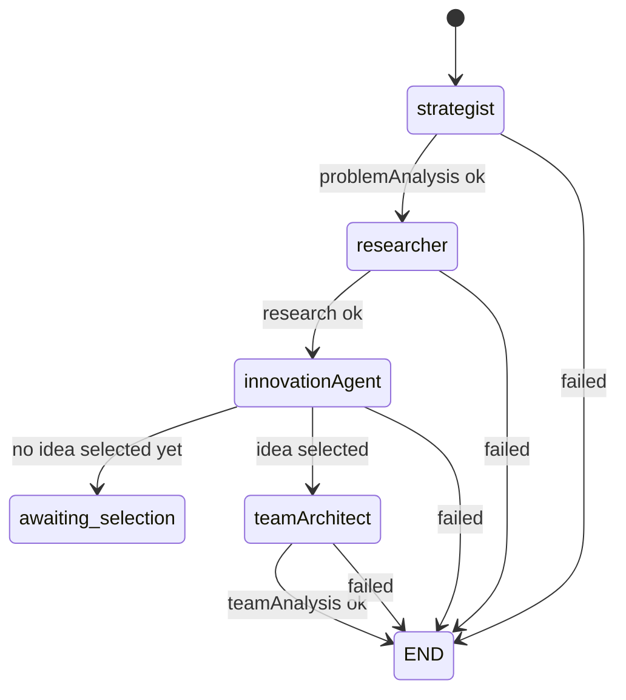

# HackForge / HackBuddy

**AI Hackathon Intelligence & Project Generation Platform**

A stateful, multi-agent system that takes a hackathon problem statement, your team's resumes and GitHub profiles, and produces an end-to-end competitive blueprint: problem analysis, live market research, candidate solution ideas, team feasibility & role assignment, tech-stack recommendation, and a complete system architecture with database schema, API contracts, and an implementation plan.

---

## Table of Contents

1. [Problem Statement](#problem-statement)
2. [Features](#features)
3. [High-Level Architecture](#high-level-architecture)
4. [Tech Stack](#tech-stack)
5. [Third-Party Tools & Services](#third-party-tools--services)
6. [Multi-Agent Workflow](#multi-agent-workflow)
7. [LangGraph State Graph](#langgraph-state-graph)
8. [State Schema (Zod)](#state-schema-zod)
9. [Database Schema (MongoDB)](#database-schema-mongodb)
10. [REST API](#rest-api)
11. [Project Structure](#project-structure)
12. [Getting Started](#getting-started)
13. [Environment Variables](#environment-variables)

---

## Problem Statement

Hackathon teams repeatedly waste their limited time on three hard, high-stakes decisions:

1. **What should we build?** — Teams guess at a problem and idea without validating what already exists in the market.
2. **Who can build it?** — Teams don't know how their skills map to the solution's requirements or where the gaps are.
3. **How do we build it fast?** — Teams lack a concrete architecture, database schema, API surface, and a phased build plan tuned to a 24–48 hour deadline.

HackForge solves this by orchestrating **five specialized AI agents** over a shared, persisted workflow state. It turns an unstructured problem statement plus resumes and GitHub links into a structured, decision-ready project blueprint — pausing for **human-in-the-loop** choices (selecting an idea, then a tech stack) exactly where a human's judgment matters most.

---

## Features

### Auth & Accounts
- JWT-based auth with **httpOnly cookies** (`bcryptjs` + `jsonwebtoken`).
- Register, login, logout, and current-user endpoints.
- Password reset via **6-digit OTP** sent over email (Nodemailer + Gmail), with OTP verify and new-password endpoints.

### Project Creation
- Multi-part upload of **PDF resumes** (Multer memory storage, `pdf-parse` text extraction).
- Optional hackathon metadata: name, description, duration, judging criteria, rules.
- Optional GitHub profile links per team member.
- **Resume structuring before persistence** — resumes are structured into skill profiles via **Featherless AI** (`structureResumes`) and stored alongside the raw text in `structuredResumes`.

### The 5-Agent Pipeline (with SSE live progress)
- **Agent 1 — Strategist:** decomposes the problem into target users, pain points, requirements, constraints, domain keywords, and success criteria.
- **Agent 2 — Researcher:** dual web search (Gemini grounding + Tavily), GitHub repo search, dedup, classification, enrichment loops, and contradiction detection.
- **Agent 3 — Innovation:** embeds & clusters existing solutions, identifies gaps, generates and scores candidate ideas, and assesses novelty/differentiation.
- **Agent 4 — Team Architect:** parses resumes, runs feasibility, assigns roles, detects skill gaps, and generates ranked tech-stack options.
- **Agent 5 — CTO:** generates architecture overview, components, data flow, database schema, API contracts, AI/RAG architecture, risks, and an implementation plan with a hackathon timeline.

### Human-in-the-Loop Decision Points
- Select a **candidate idea** (pauses workflow in `awaiting_selection`).
- Select a **tech stack** (resumes the CTO agent).

### Observability
- **SSE** event stream (`/api/hackathons/:id/events`) broadcasting per-agent progress events.
- Usage metrics tracked per project (LLM calls, search calls, cache hits/misses).
- Workflow status + execution errors persisted and surfaced in the UI.

### Frontend
- Dashboard listing past projects with stage completion indicators.
- Create form with dynamic team members, judging criteria, and rules.
- Live project page that polls agent results, shows stage badges, and hosts the idea/tech-stack selection UI.
- Responsive dark UI built on Tailwind + shadcn-style Radix components.

---

## High-Level Architecture

```
┌─────────────────────┐        /api (proxy)        ┌──────────────────────────────┐
│   Frontend (Vite)   │  ────────────────────────▶ │   Backend (Express + TS)     │
│  React 19 + Tailwind│                            │                              │
│  port 5173          │  ◀──────────────────────── │   port 3000                  │
└─────────────────────┘      JSON / SSE events     └──────────────┬───────────────┘
                                                                  │
                                          ┌───────────────────────┼───────────────────────┐
                                          ▼                       ▼                       ▼
                                  ┌──────────────┐        ┌───────────────┐       ┌──────────────┐
                                  │  MongoDB     │        │  LangGraph    │       │ 3rd-party    │
                                  │  (Mongoose)  │        │  multi-agent  │       │ APIs: Gemini │
                                  │  port 27017  │        │  state graph  │       │  DeepSeek    │
                                  └──────────────┘        └───────────────┘       │  Tavily      │
                                                                                   │  GitHub      │
                                                                                   │  Featherless │
                                                                                   └──────────────┘
```

The **LangGraph state graph** (`backend/src/graph/hackforgeGraph.ts`) is the heart of the system. Each agent is a node that reads from and writes to a shared, JSON-serializable `HackathonState`. State is persisted to MongoDB after each phase so a long-running workflow can be **paused and resumed** across user decisions (or server restarts).

---

## Tech Stack

### Backend (`backend/`)
| Area | Technology |
|------|-----------|
| Runtime | Node.js (22+) |
| Language | TypeScript (`commonjs`) |
| Web framework | Express 4 |
| AI orchestration | `@langchain/langgraph` (StateGraph), `@langchain/core` |
| LLM SDKs | `@langchain/google-genai`, `@langchain/openai`, `@google/generative-ai` |
| Database | MongoDB via Mongoose 8 |
| Schema validation | Zod 3 |
| Auth | `jsonwebtoken`, `bcryptjs`, `cookie-parser` |
| File upload | Multer (memory storage, PDF-only) |
| PDF parsing | `pdf-parse` |
| Email | Nodemailer (Gmail transport) |
| Real-time events | Server-Sent Events (native Express `res.write`) |
| Dev server | `ts-node-dev` (transpile-only, auto-reload) |

### Frontend (`frontend/`)
| Area | Technology |
|------|-----------|
| Framework | React 19 |
| Language | TypeScript |
| Build tool | Vite 8 |
| Routing | React Router DOM 7 |
| Styling | Tailwind CSS 4 |
| UI primitives | Radix UI (dialog, tabs, accordion, select, progress, etc.) + `class-variance-authority`, `clsx`, `tailwind-merge` |
| Icons | `lucide-react` |
| Toasts | `sonner` |
| Dev proxy | Vite `server.proxy` → `http://localhost:3000` |

---

## Third-Party Tools & Services

| Service | Purpose | Where used |
|---------|---------|------------|
| **Google Gemini** (`gemini-3.6-flash`) | Research agent LLM + **live web search grounding** | `agents/researcher`, `tools/gemini/geminiWebSearch.tool.ts` |
| **DeepSeek** (`deepseek-chat`) | Strategist, Innovation, Team Architect, and CTO LLMs (via OpenAI-compatible API) | `utils/llmFactory.ts` → all non-research agents |
| **Featherless AI** (`deepseek-ai/DeepSeek-V4-Pro`) | Resume structuring before DB persistence | `services/resumeStructuringService.ts` |
| **Groq** (`openai/gpt-oss-20b`) | Optional configured model (not wired by default) | `config/env.ts` |
| **Tavily** | Web search + deep URL extraction | `tools/tavily/*`, `services/webResearchService.ts` |
| **GitHub REST API** | Repo search, repo metadata, README, file contents (deep extraction) | `tools/github/githubTools.ts` |
| **MongoDB** | Primary data store + search cache | `config/mongodb.ts`, all models |
| **Gmail SMTP** (Nodemailer) | Password-reset OTP emails | `config/nodemailer.ts`, `controllers/auth.controller.ts` |

> **LLM routing** is centralized in `utils/llmFactory.ts`: only the `research` capability uses Gemini; every other capability (`strategic_analysis`, `innovation`, `coding`, `reasoning`) is routed to **DeepSeek**. Per-capability temperature/token config lives in `config/model.config.ts`.

---

## Multi-Agent Workflow

The pipeline runs in **three phases** with two human-in-the-loop pauses.

### Phase 1 — Discovery (automatic)
```
Strategist → Researcher → Innovation  ──▶  PAUSE (awaiting_selection)
```
1. **Strategist** (`agents/strategist`): produces a `ProblemAnalysis` (target users, pain points, requirements, constraints, research dimensions/questions). Validated and retried up to 4× on schema/validation failure.
2. **Researcher** (`agents/researcher`): 
   - Builds a research plan & generates discovery queries.
   - Runs a **discovery loop** (dual Gemini+Tavily web search + GitHub search, dedup, LLM classification, deterministic ranking).
   - Runs an **enrichment loop** per top candidate (field extraction, deep Tavily extract, GitHub README/`package.json` etc., contradiction detection).
   - Budgets are enforced per mode (`fast`/`balanced`/`deep`) in `config/research.config.ts`.
3. **Innovation** (`agents/innovation`): embeds/clusters solutions, builds a feature landscape, identifies gaps, generates & scores candidate ideas, and computes novelty + differentiation + capability requirements.

### Phase 2 — Team Architect (after idea selection)
```
User selects a candidate idea  ──▶  Team Architect
```
4. **Team Architect** (`agents/team`):
   - Parses resumes into `TeamMemberProfile`s (or synthesizes profiles if none).
   - Feasibility analysis (expands the solution, checks data needs & risks).
   - Role assignment & skill-gap detection.
   - Generates ranked **tech-stack options**.

### Phase 3 — CTO (after tech-stack selection)
```
User selects a tech stack  ──▶  CTO Agent
```
5. **CTO** (`agents/cto`): analyzes GitHub profiles, then generates:
   - Architecture overview, components, and data flow.
   - Database schema + API contracts.
   - AI pipeline & RAG architecture.
   - Implementation plan, technical risks, and hackathon timeline.

The final state (with `teamAnalysis.selectedTechStack` and full `architecture`) marks the workflow **completed**.

---

## LangGraph State Graph

Defined in `backend/src/graph/hackforgeGraph.ts` using `@langchain/langgraph`'s `StateGraph`.

### Nodes
| Node | Handler | Agent |
|------|---------|-------|
| `strategist` | `strategistNode` | Strategist (DeepSeek) |
| `researcher` | `researcherNode` | Researcher (Gemini + Tavily + GitHub) |
| `innovationAgent` | `innovationNode` | Innovation (DeepSeek) |
| `teamArchitect` | `teamArchitectNode` | Team Architect (DeepSeek) — *invoked on resume* |
| `cto` | `ctoNode` | CTO (DeepSeek) — *invoked on resume* |

### Graph (Mermaid)



### Conditional routing

| After node | Condition | Routes |
|-----------|-----------|--------|
| `strategist` | `shouldContinueAfterStrategist` | `researcher` or `fail → END` |
| `researcher` | `shouldContinueAfterResearcher` | `innovationAgent` or `fail → END` |
| `innovationAgent` | `shouldContinueAfterInnovation` | `teamArchitect`, `awaiting_selection → END`, or `fail → END` |
| `teamArchitect` | `shouldContinueAfterTeamArchitect` | `end → END` or `fail → END` |

### Phase resume functions

| Function | Trigger | Behavior |
|----------|---------|----------|
| `runHackforgeWorkflow` | `POST /hackathons/:id/start` | Runs Strategist → Researcher → Innovation |
| `resumeAfterCandidateSelection` | `POST /hackathons/:id/select-candidate` | Runs **only** `teamArchitectNode` against the saved state |
| `resumeAfterTechStackSelection` | `POST /hackathons/:id/select-tech-stack` | Runs **only** `ctoNode` against the saved state |

### State annotation reducers

The `HackathonStateAnnotation` (`graph/state.ts`) defines how node updates merge into the graph state:

| Field | Reducer |
|-------|---------|
| `projectId`, `input`, `problemAnalysis`, `research`, `innovation`, `teamAnalysis`, `architecture`, `judging`, `build`, `selectedVersion`, `status` | replace-on-update |
| `improvementHistory`, `errors` | append (`[...current, ...update]`) |
| `usage` | field-wise **addition** (accumulates LLM/search/cache counters) |

---

## State Schema (Zod)

All schemas live in `backend/src/graph/state.ts`. This is the shared contract between agents, the graph, and the persisted `workflowState`.

### Input — `StrategistInputSchema`
```ts
{
  problemStatement: string            // min 10 chars
  resumes?: string[]                  // raw resume text (default [])
  githubLinks?: { githubProfileUrl, username, role? }[]
  hackathon?: { name?, description?, durationHours?, judgingCriteria?, rules?, restrictions?, allowedTechnologies?, forbiddenTechnologies? }
  userConstraints?: string[]
  teamSize?: number
}
```

### Agent 1 output — `ProblemAnalysisSchema`
`coreProblem`, `problemSummary`, `targetUsers[]`, `painPoints[]`, `desiredOutcomes[]`, `explicitRequirements[]`, `inferredRequirements[]`, `constraints[]`, `domainKeywords[]`, `successCriteria[]`, `hackathonConsiderations[]`, `researchQuestions[]`, `researchDimensions[]`, `ambiguities?`, `analysisConfidence`.

### Agent 2 output — `ResearchResultSchema`
`researchId`, `summary` (queries/sources/solutions counts), `sources[]`, `discoveredSolutions[]`, `coverage`, `unresolvedQuestions[]`, `contradictions[]`. Each `DiscoveredSolution` carries `features[]`, `workflow[]`, `technologies[]`, `limitations[]`, `relationToProblem` (`direct` | `adjacent` | `technical`), and `confidence`.

### Agent 3 output — `InnovationResultSchema`
`innovationId`, `candidateIdeas[]`, `selectedIdea?`, `solutionLandscape`, `featureLandscape[]`, `identifiedGaps[]`, `differentiation`, `noveltyAssessment`, `projectCapabilityRequirements`, `validationQuestions[]`, `confidence`.

### Agent 4 output — `TeamAnalysisSchema`
- `teamMembers[]` → `TeamMemberProfileSchema`: `{ memberId, name, parsedSkills[], primaryRole, proficiencyLevels, resumeSnippet, githubUsername?, yearsExperience? }`
- `roleAssignments[]`, `skillGaps[]`, `dataAvailability[]`
- `expandedSolution`
- `feasibility` → `{ score, summary, teamStrengths[], teamWeaknesses[], timeRisk, technicalRisk, dataRisk, recommendations[] }`
- `techStackOptions[]` → `TechStackOptionSchema` (`frontend[]`, `backend[]`, `database[]`, `aiMl[]`, `infrastructure[]`, `teamFitScore`, `overallScore`, …)
- `selectedTechStack?`, `overallTeamStrategy`

### Agent 5 output — `ArchitectureResultSchema`
`architectureId`, `selectedTechStack`, `architectureOverview`, `components[]` (`ComponentSchema` with `type: frontend|backend|ai_engine|vector_db|database|cache|background_service|external_api|other`), `dataFlow[]`, `databaseSchema[]`, `apiContracts[]`, `aiArchitecture`, `ragArchitecture?`, `externalServices[]`, `risks[]`, `implementationPlan[]`, `hackathonTimeline`, `confidence`, `estimatedDemoReadiness`.

### Workflow — `HackathonStateSchema`
```ts
{
  projectId, input,
  problemAnalysis?, research?, innovation?, teamAnalysis?, architecture?,
  judging?, improvementHistory[], selectedVersion, build?,
  status: "idle" | "running" | "paused" | "completed" | "failed" | "cancel_requested" | "awaiting_selection",
  errors[], usage
}
```

### Resume extraction — `ResumeExtractionOutputSchema` (`prompts/resumeExtractor.ts`)
`{ members: [{ memberId, name, parsedSkills[], primaryRole, proficiencyLevels{}, resumeSnippet, githubUsername?, yearsExperience? }] }` — used by both the Featherless pre-persistence pass and the Team Architect's DeepSeek parser.

---

## Database Schema (MongoDB)

Models are defined with Mongoose in `backend/src/models/`.

### `User`
`name`, `email` (unique, lowercased), `password` (bcrypt hash), `resetOtp`, `resetOtpExpire`.

### `HackathonProject` (core project record)
`projectId` (unique), `userId` (indexed), `problemStatement`, `resumes[]` (raw text), `structuredResumes[]` (Featherless-structured skill profiles), `githubLinks[]`, `hackathon` (name/description/duration/judgingCriteria/rules/restrictions/allowedTechnologies/forbiddenTechnologies), `userConstraints[]`, `teamSize`, `status`, `lastError`, `executionErrors[]`, `workflowState` (mixed — the persisted LangGraph state), and `usage` counters (`geminiCalls`, `geminiSearchCalls`, `deepseekCalls`, `tavilyCalls`, `githubCalls`, `llmTokens`, `cacheHits`, `cacheMisses`).

### `ProblemAnalysis`
`projectId` (indexed), `agent`, `version` (compound index with projectId), `output` (mixed).

### `ResearchRun`
`projectId`, `researchId` (unique), `status` (`running|completed|failed|partial`), `mode` (`fast|balanced|deep`), `budget`, `metrics` (search call + source counts), `stoppingReason`, `result` (mixed), `startedAt`, `completedAt`, `error`.

### `InnovationResult`
`projectId`, `innovationId` (unique), `status` (`running|completed|failed`), `candidateCount`, `selectedCandidateId`, `result` (mixed), timestamps, `error`.

### `TeamAnalysisRecord`
`projectId`, `teamAnalysisId`, `status`, `teamMemberCount`, `feasibilityScore`, `techStackOptionCount`, `selectedTechStackId`, `result` (mixed), `error`.

### `ArchitectureResult`
`projectId`, `architectureId`, `status`, `componentCount`, `collectionCount`, `endpointCount`, `confidence`, `selectedTechStackId`, `result` (mixed), `error`.

### Research support models
- `SourceRecord` — normalized search sources with authority scores.
- `SearchCache` — cached search results (SHA-256 query hash → results), TTL-based.

---

## REST API

Base path: `/api`. All project routes are JWT-protected (`isAuth`).

### Auth (`/api/auth`)
| Method | Path | Description |
|--------|------|-------------|
| POST | `/register` | Create account, sets auth cookie |
| POST | `/login` | Login, sets auth cookie |
| POST | `/logout` | Clears cookie |
| GET | `/me` | Current user (auth) |
| POST | `/forget-password` | Emails OTP |
| POST | `/verify-otp` | Verifies OTP |
| POST | `/new-password` | Resets password |

### Hackathons (`/api/hackathons`)
| Method | Path | Description |
|--------|------|-------------|
| POST | `/` | Create project (multipart PDF upload or JSON resumes) |
| GET | `/` | List user's projects |
| GET | `/:id/status` | Project status + errors + usage |
| POST | `/:id/start` | Start the agent pipeline |
| GET | `/:id/events` | **SSE** live agent events |
| GET | `/:id/analysis` | Agent 1 — problem analysis |
| GET | `/:id/research` | Agent 2 — research result |
| GET | `/:id/innovation` | Agent 3 — innovation result |
| POST | `/:id/select-candidate` | Select an idea → resumes Team Architect |
| GET | `/:id/team` | Agent 4 — team analysis |
| POST | `/:id/select-tech-stack` | Select a stack → resumes CTO |
| GET | `/:id/architecture` | Agent 5 — architecture result |

> Note: result endpoints return **404** until the corresponding agent has produced output; the frontend polls these and safely ignores 404s while the workflow is running.

---

## Project Structure

```
Hackwave-Project/
├── backend/
│   ├── .env
│   ├── package.json
│   └── src/
│       ├── server.ts                  # Express bootstrap
│       ├── config/                    # env, mongodb, model routing, research budgets, nodemailer
│       ├── routes/                    # auth.routes, hackathon.routes
│       ├── controllers/               # auth.controller, hackathon.controller
│       ├── middleware/                # auth (JWT), upload (Multer/PDF)
│       ├── models/                    # Mongoose models (User, HackathonProject, ResearchRun, …)
│       ├── graph/
│       │   ├── state.ts               # Zod schemas + LangGraph annotation
│       │   ├── hackforgeGraph.ts      # StateGraph definition + phase resume
│       │   └── nodes/                 # strategistNode, researcherNode, innovationNode, teamArchitectNode, ctoNode
│       ├── agents/
│       │   ├── strategist/            # agent + validator
│       │   ├── researcher/            # agent + researcherNodes
│       │   ├── innovation/            # vectorClustering, gapAnalysis, candidateGenerator, candidateRanker
│       │   ├── team/                  # team.agent, resumeParser, roleMatcher, feasibilityAnalyzer, techStackGenerator
│       │   └── cto/                   # cto.agent, architectureGenerator, schemaContractGenerator, aiRagArchitect, implementationPlanner, githubProfileAnalyzer
│       ├── services/                  # webResearchService, resumeStructuringService, dedup, ranking, evidence merger, …
│       ├── tools/                     # tavily, gemini, github LangChain tools
│       ├── prompts/                   # all system/user prompt templates
│       └── utils/                     # llmFactory, llmRetry, pdfParser, sseStreamer
│
└── frontend/
    ├── vite.config.ts                 # dev proxy /api → localhost:3000
    ├── package.json
    └── src/
        ├── main.tsx / App.tsx         # router + auth provider
        ├── pages/                     # Home, Login, Signup, Dashboard, Create, Project
        ├── components/
        │   ├── sections/              # AnalysisSection, ResearchSection, InnovationSection, TeamSection, ArchitectureSection
        │   ├── ui/                    # shadcn-style primitives
        │   └── layout.tsx, require-auth.tsx, widgets.tsx, section.tsx
        ├── context/auth.tsx           # auth context
        └── lib/                       # api.ts, types.ts, utils.ts
```

---

## Getting Started

### Prerequisites
- Node.js 22+, npm
- MongoDB running locally (default `mongodb://localhost:27017`)
- API keys for the providers you want active (see [Environment Variables](#environment-variables))

### 1. Backend
```bash
cd backend
cp .env.example .env   # if present; otherwise create .env (see below)
npm install
npm run dev            # ts-node-dev on http://localhost:3000
```

### 2. Frontend
```bash
cd frontend
npm install
npm run dev            # Vite on http://localhost:5173 (proxies /api → 3000)
```

### 3. Test the flow
1. Register an account (or use a test user).
2. **Create** a project — paste a problem statement and upload 1–5 resume PDFs (optionally add GitHub links).
3. The pipeline auto-starts: watch the stage badges progress via the SSE stream.
4. When it pauses, **select a candidate idea**, then **select a tech stack** to reach the final architecture.

### Scripts
| Command | Where | Purpose |
|---------|-------|---------|
| `npm run dev` | backend | Start dev server (auto-reload) |
| `npm run build` | backend | Type-check & compile (`tsc`) |
| `npm run lint` | backend | ESLint |
| `npm run test` / `test:integration` | backend | Jest suites |
| `npm run dev` | frontend | Vite dev server |
| `npm run build` | frontend | `tsc -b && vite build` |
| `npm run lint` | frontend | ESLint |

---

## Environment Variables

`backend/.env` (validated by `config/env.ts`):

| Variable | Default | Description |
|----------|---------|-------------|
| `NODE_ENV` | `development` | `development` \| `production` \| `test` |
| `PORT` | `4000` | Backend port (repo `.env` uses `3000` to match the Vite proxy) |
| `MONGODB_URI` | `mongodb://localhost:27017/hackforge` | MongoDB connection string |
| `GEMINI_API_KEY` | — | Google Gemini key (Researcher + web search grounding) |
| `GEMINI_MODEL` | `gemini-3.6-flash` | Gemini model |
| `DEEPSEEK_API_KEY` | — | DeepSeek key (Strategist/Innovation/Team/CTO) |
| `DEEPSEEK_BASE_URL` | `https://api.deepseek.com/v1` | DeepSeek API base |
| `DEEPSEEK_MODEL` | `deepseek-chat` | DeepSeek model |
| `FEATHERLESS_API_KEY` | — | Featherless key (resume structuring) |
| `FEATHERLESS_BASE_URL` | `https://api.featherless.ai/v1` | Featherless API base |
| `FEATHERLESS_MODEL` | `deepseek-ai/DeepSeek-V4-Pro` | Featherless model |
| `GROQ_API_KEY` / `GROQ_MODEL` | — | Optional Groq model (configured, not wired by default) |
| `TAVILY_API_KEY` | — | Tavily search/extract key |
| `GITHUB_TOKEN` | — | GitHub API token (optional, raises rate limits) |
| `VECTOR_DB_PROVIDER` | `mongodb` | Vector DB provider (for innovation clustering) |
| `VECTOR_DB_URL` / `VECTOR_DB_API_KEY` | — | Optional vector DB config |
| `JWT_SECRET` | `hackwave-jwt-secret` | JWT signing secret |
| `EMAIL_USER` / `EMAIL_PASS` | — | Gmail credentials for password-reset OTP |

> **Important:** the frontend Vite proxy targets `http://localhost:3000`. If you change `PORT` in the backend, update `frontend/vite.config.ts` to match.
